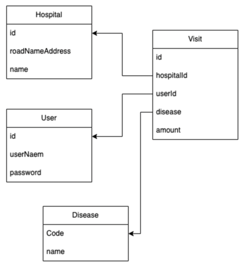

# Spring Security & JWT 실습

---

### 다이어그램

---
### 구현기능
| 기능              | api |
|-----------------|-----|
| 방문기능            |/api/v1/visits|
| 방문 전체 조회        |/api/v1/visits|
| 특정 이용자의 방문기록 조회 |/api/v1/visits|
| 특정 병원의 방문기록 조회  |/api/v1/visits|

---
| Commit   |Convention|
|----------|---|
| 제목       |설명|
| FEAT     |새로운 기능 추가|
| FIX      |버그 수정|
| DOCS     |문서 수정|
| STYLE    |코드 포맷팅|
| REFACTOR |코드 리펙토링|
| TEST     |테스트 및 테스트 코드 관련|
| CHORE    |빌드 및 패키지 매니저 수정 관련|